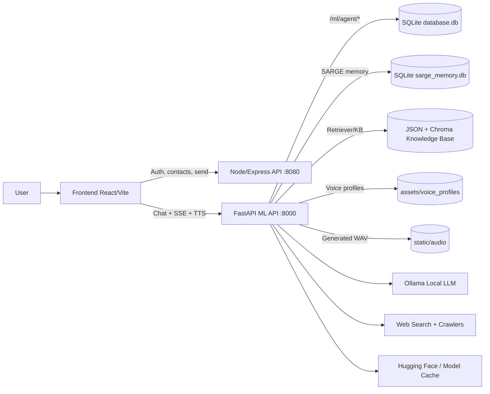
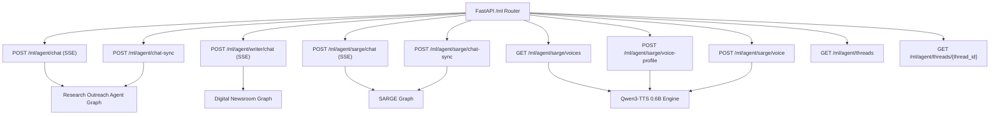
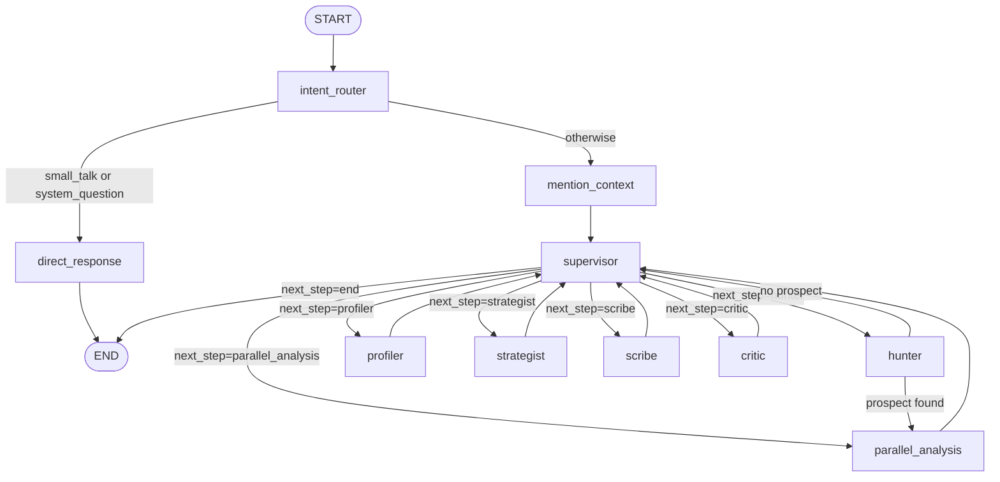
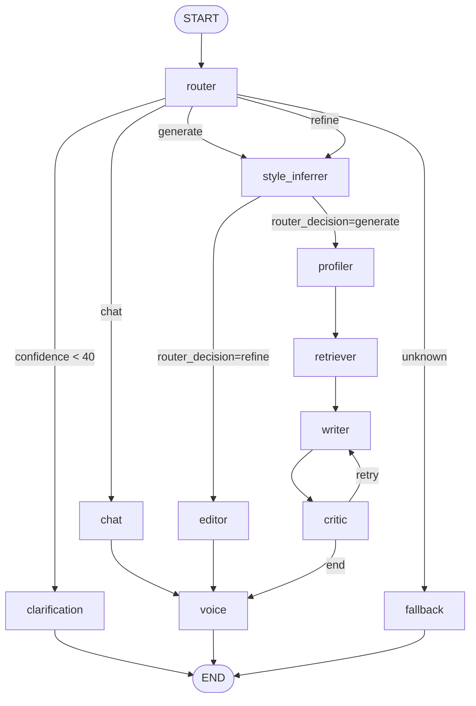
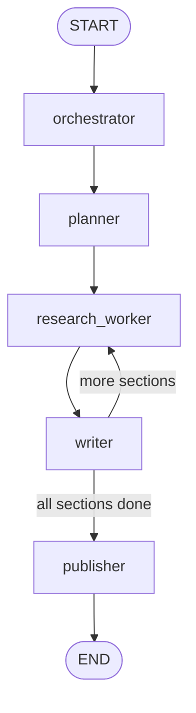

# Xenia26 Agent Architecture Map

This document is code-accurate to the current implementation in:
- `fastapi/ml/routes.py`
- `fastapi/ml/application/agent/graph.py`
- `fastapi/ml/application/sarge/graph.py`
- `fastapi/ml/ollama_deep_researcher/graph.py`

## 1. System Architecture Map



## 2. Route-to-Agent Map



## 3. Agent Graph A: Research Outreach Agent (`ml/application/agent`)

### Runtime behavior
- Entry point: `intent_router`.
- Direct bypass for `small_talk` and `system_question`.
- Supervisor-driven loop for heavy outreach generation.
- `parallel_analysis` runs `profiler` + `strategist` concurrently.



## 4. Agent Graph B: SARGE (`ml/application/sarge`)

### Runtime behavior
- Entry point: `router`.
- Low-confidence intent routes to `clarification`.
- `generate` and `refine` both pass through `style_inferrer`.
- Critic loop retries writer up to 2 attempts.
- Voice synthesis is the terminal stage for chat/generation/edit flows.



### TTS sub-architecture used by SARGE

```mermaid
flowchart LR
    TXT[Input Text] --> CLEAN[Strip headers / Subject / To / CC]
    CLEAN --> PICK[Resolve voice mode + profile]
    PICK --> PROMPT[Ensure clone prompt]
    PROMPT --> QWEN[Qwen3-TTS-12Hz-0.6B-Base]
    QWEN --> WAV[Write WAV to static/audio]
    WAV --> URL[/static/audio/...]
```

## 5. Agent Graph C: Digital Newsroom (`ml/ollama_deep_researcher`)

### Runtime behavior
- Entry point: `orchestrator`.
- Loops `research_worker -> writer` per planned section.
- Publishes only when `current_section_index >= len(outline)`.



## 6. State and Storage Map

| Area | Storage | Purpose |
|---|---|---|
| Thread history | `database.db` | `/ml/agent/chat*` + writer thread persistence |
| SARGE memory | `fastapi/ml/application/sarge/sarge_memory.db` | Session-level short history for SARGE |
| Voice profiles | `assets/voice_profiles/` + `profiles.json` | Uploaded clone references and defaults |
| Generated audio | `static/audio/` | WAV files returned to frontend |
| Knowledge base | `ml/application/agent/data/` | Prospect JSON, psych JSON, Chroma vector history |

## 7. Key Integration Notes

- Agent modules are lazy-loaded from `ml/routes.py` (`_ensure_agent_loaded`, `_ensure_sarge_loaded`, `_ensure_deep_research_loaded`) to keep startup resilient.
- TTS is lazy-loaded independently (`_load_tts_or_503`) so SARGE text flows can still run if voice dependencies fail.
- Subject/header stripping for TTS happens before synthesis (`_extract_tts_body_text`), so spoken audio is body-focused instead of reading email headers.
