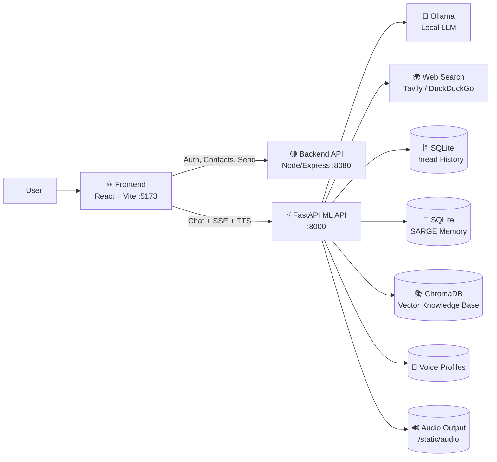
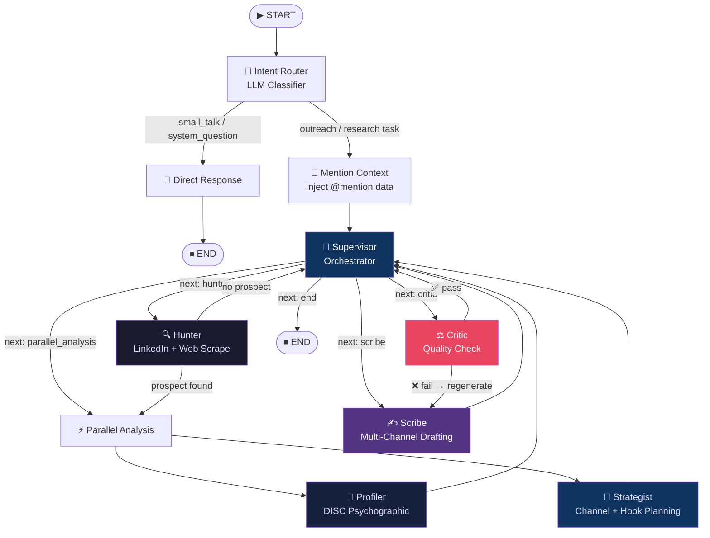
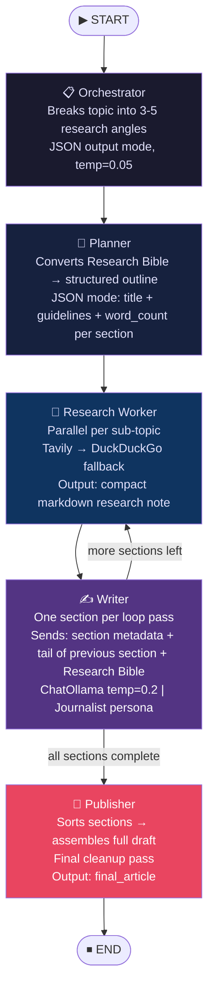
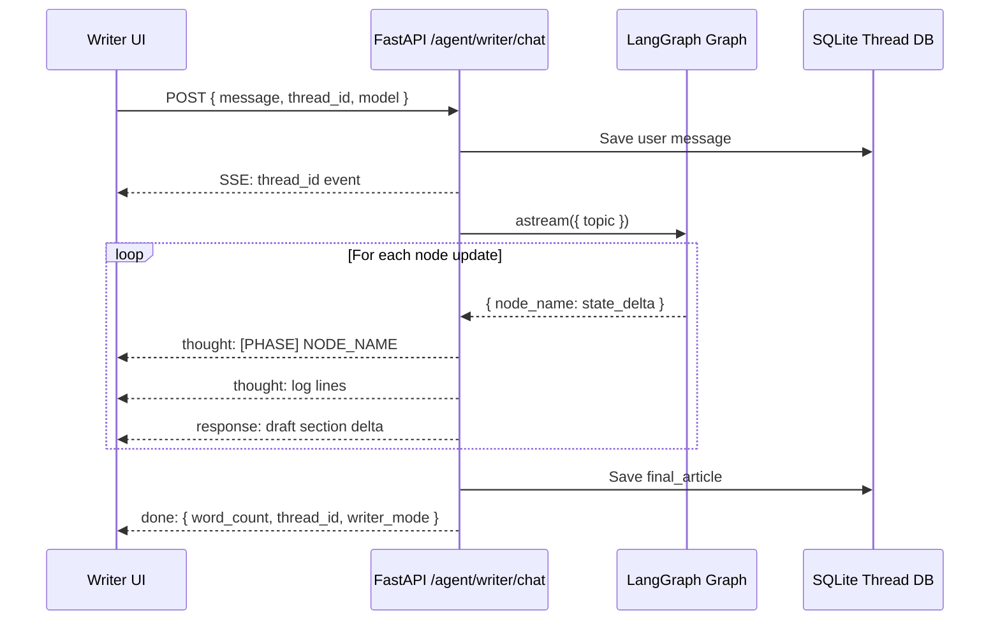
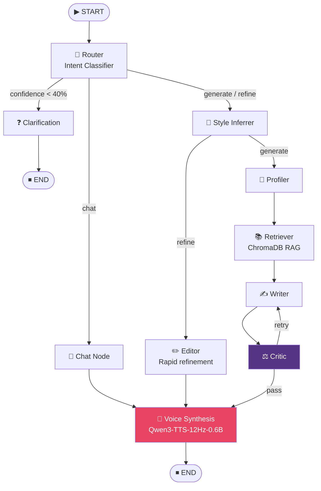

<div align="center">

# 🤖 Xenia26 — OutreachAI

**Local-first, AI-powered outreach automation. Research, profile, draft, and send — all in one agent pipeline.**

[](https://fastapi.tiangolo.com/)
[](https://langchain-ai.github.io/langgraph/)
[](https://reactjs.org/)
[](https://ollama.ai/)
[](LICENSE)

</div>

---

## 📸 Screenshots

<table>
  <tr>
    <td align="center" width="50%">
      
      <br/><sub><b>Outreach Chat — Start a new conversation</b></sub>
    </td>
    <td align="center" width="50%">
      
      <br/><sub><b>Multi-Channel Draft Cards — Email, LinkedIn, WhatsApp</b></sub>
    </td>
  </tr>
  <tr>
    <td align="center" width="50%">
      
      <br/><sub><b>Live Streaming — Watch the agent think in real time</b></sub>
    </td>
    <td align="center" width="50%">
      
      <br/><sub><b>@Mention Context — Inject contact details instantly</b></sub>
    </td>
  </tr>
  <tr>
    <td align="center" width="50%">
      
      <br/><sub><b>Writer Studio — AI-powered article and content drafting</b></sub>
    </td>
    <td align="center" width="50%">
      
      <br/><sub><b>SARGE Agent — Voice synthesis with Qwen3-TTS</b></sub>
    </td>
  </tr>
  <tr>
    <td align="center" colspan="2">
      
      <br/><sub><b>Persistent Thread History — Resume any conversation</b></sub>
    </td>
  </tr>
</table>

---

## 🚨 The Problem

Cold outreach is broken. Sales reps and founders spend **hours** per prospect:

- Manually reading LinkedIn profiles, blog posts, and company news
- Guessing which channels (email? DM? WhatsApp?) are most likely to get a reply
- Writing generic templates that feel impersonal and get ignored
- Re-drafting the same message 4 times until it finally sounds human
- Copy-pasting between tools with no unified workflow

The result? **Low reply rates, high time cost, and burned-out teams.**

---

## ✅ How OutreachAI Solves This

Xenia26 replaces that manual loop with a **supervised AI agent pipeline**. You describe your goal in natural language. The agents handle the rest:

| Problem | OutreachAI Solution |
|---|---|
| Hours of research per prospect | **Hunter agent** scrapes LinkedIn + web in seconds |
| Unknown personality/tone fit | **Profiler** builds a DISC psychographic profile |
| Wrong channel selection | **Strategist** picks email, DM, or WhatsApp based on context |
| Generic copy | **Scribe** generates channel-optimized, personalized drafts |
| Garbage outputs | **Critic** rejects and regenerates until quality passes |
| No voice follow-up | **Qwen3-TTS** synthesizes voiced audio of your message |

The platform is **100% local-first** — no data leaves your machine. All generation happens through Ollama running on your hardware.

---

## 🔭 Platform Overview

Xenia26 is a **three-service system**:

```
Xenia26/
  Frontend/    ← React + Vite chat UI with draft preview cards
  backend/     ← Node/Express: auth, contacts, send actions
  fastapi/     ← FastAPI + LangGraph: all AI agents and TTS
```

The `fastapi/` service hosts **three independent agent systems**:

| Agent | Endpoint | Purpose |
|---|---|---|
| **Research Outreach Agent** | `/ml/agent/chat` | Deep-psych outreach pipeline |
| **Digital Newsroom (Writer)** | `/ml/agent/writer/chat` | Long-form AI article generation |
| **SARGE** | `/ml/agent/sarge/chat` | Conversational assistant + voice |

---

## 🏗️ System Architecture

The full platform flow from browser to local LLM:



---

## 🤖 Agent Architectures

### Agent 1 — Research Outreach Pipeline

The flagship pipeline for deep prospect research and personalized multi-channel draft generation.



**Each agent node explained:**

| Node | Role | What it does |
|---|---|---|
| `intent_router` | Gatekeeper | Classifies intent; extracts the "Topic Lock" for focus |
| `mention_context` | Context injector | Pulls `@mention` contact data into the conversation state |
| `supervisor` | Orchestrator | Decides the next node to invoke based on current state |
| `hunter` | Researcher | Scrapes LinkedIn, web, and news using DuckDuckGo + custom crawlers |
| `profiler` | Psychologist | Builds a DISC personality profile; infers tone, communication style |
| `strategist` | Planner | Selects optimal channels (email/LinkedIn/WhatsApp/SMS) and crafts the hook angle |
| `scribe` | Writer | Generates parallel multi-channel drafts with strict 4-part email structure |
| `critic` | QA loop | Checks drafts for hallucinations, instruction adherence, and personalization depth; rejects and forces retry |

---

### Agent 2 — Digital Newsroom (Writer Agent)

A dedicated long-form content pipeline that researches, plans, writes, and edits full articles section-by-section. Used by the **Writer Studio** interface.



#### Writer Agent — Node-by-Node Detail

**1. `orchestrator`** — _Editor-in-Chief_
- Reads the user topic from `state.topic`
- Calls `ChatOllama` in JSON mode (temperature `0.05`) with `ORCHESTRATOR_PROMPT`
- Produces 3–5 focused `sub_topics` as research angles
- Uses `_coerce_sub_topics()` to normalize and de-duplicate; falls back to smart defaults for known subjects (e.g., Attention Is All You Need)
- Resets all writing state fields for a clean run

**2. `planner`** — _Architect_
- Receives the `research_bible` (compiled by synthesizer, or built inline)
- Calls `ChatOllama` in JSON mode (temperature `0.05`) with `PLANNER_PROMPT`
- Produces a structured outline: `[{title, guidelines, evidence_hint, word_count}, ...]`
- `_normalize_outline()` validates, pads missing sections, and enforces `word_count ∈ [120, 320]`
- Targets **5 sections** for articles ≥900 words, **4** for ≥700, **3** for shorter pieces

**3. `research_worker`** — _Field Researcher_ _(parallel per sub-topic)_
- Receives one `sub_topic` from the fan-out
- Tries **Tavily** first (`_tavily_search`); falls back to **DuckDuckGo** (`_duckduckgo_search`)
- Filters results for topic relevance using `_filter_search_results_by_topic()`
- Builds a compact markdown research note:
  ```
  ### <sub_topic>
  - [domain] Title | Summary | URL
  ```
- Result goes into `gathered_notes` (parallel reducer, no ordering required)

**4. `writer`** — _Journalist_ _(loop: one section per pass)_
- Reads `outline[current_section_index]` for the current section metadata
- Calls `_tail_sentences()` on previous section to maintain narrative continuity
- Sends **only focused context** to the LLM:
  - Current section: `title`, `guidelines`, `evidence_hint`, `word_count`
  - Previous section tail (last 3 sentences, max 500 chars)
  - Full `research_bible` (sliced to fit context window)
- Calls `ChatOllama` (temperature `0.2`) with `WRITER_PROMPT` (Journalist persona)
- Validates output with `_is_generic_or_drifting()` and `_looks_robotic()` quality guards
- Ensures section starts with `##` markdown heading
- Updates `draft_sections[index]` and increments `current_section_index`
- Loop continues until `current_section_index >= len(outline)`

**5. `publisher`** — _Editor_
- Sorts `draft_sections` by index with `_sorted_section_items()`
- Joins into one cohesive full draft
- Strips `<think>…</think>` reasoning tokens with `strip_thinking_tokens()`
- Sanitizes writer artifacts (banned prefixes, instruction leakage) with `_sanitize_writer_output()`
- Writes `final_article` to state

#### Writer Agent — State Schema

```python
class AgentState(TypedDict):
    topic: str                        # The user's writing request
    sub_topics: List[str]             # Research angles (from orchestrator)
    gathered_notes: List[str]         # Parallel research results (reducer)
    research_bible: str               # Synthesized source document
    outline: List[Dict[str, Any]]     # Planned sections
    current_section_index: int        # Writer loop cursor
    draft_sections: Dict[int, str]    # Per-section markdown
    final_article: str                # Final polished output
    logs: List[str]                   # Streamed thought events
```

#### Writer Agent — Streaming Flow



#### Writer Agent — Reliability & Quality Guardrails

| Guard | Mechanism |
|---|---|
| Search failure | Tavily → DuckDuckGo automatic fallback |
| Bad JSON from LLM | `_safe_json_loads()` strips code fences and retries |
| Thin/missing outline | `_normalize_outline()` seeds sections with auto-generated titles |
| Robotic prose | `_looks_robotic()` checks sentence starter duplication and cliché markers |
| Topic drift | `_is_generic_or_drifting()` checks off-topic markers |
| Thinking token leakage | `strip_thinking_tokens()` removes `<think>…</think>` blocks |
| Stream miss recovery | Falls back to `graph.ainvoke()` to recover final text |

---

### Agent 3 — SARGE

Conversational assistant with real-time voice synthesis.



---

## 🗄️ Storage Map

| Area | Storage Backend | Purpose |
|---|---|---|
| Thread history | `fastapi/database.db` (SQLite) | `/ml/agent/chat` + writer thread persistence |
| SARGE memory | `fastapi/ml/application/sarge/sarge_memory.db` | Session-level short-term memory |
| Voice profiles | `assets/voice_profiles/` + `profiles.json` | Uploaded voice clone references |
| Generated audio | `static/audio/` | WAV files served back to frontend |
| Knowledge base | `ml/application/agent/data/` | Prospect JSON, psych profiles, Chroma vector history |

---

## 🛠️ Tech Stack

| Layer | Technology |
|---|---|
| **Frontend** | React 18, Vite, TailwindCSS, Axios, Server-Sent Events |
| **Backend API** | Node.js, Express, MongoDB |
| **ML API** | Python 3.11, FastAPI, Uvicorn, Pydantic |
| **AI Orchestration** | LangGraph (StateGraph), LangChain |
| **LLM Inference** | Ollama (local), `instructor` for structured JSON |
| **Vector DB** | ChromaDB (optional RAG) |
| **Database** | SQLite (threads), MongoDB (users/contacts) |
| **Search** | Tavily API, DuckDuckGo (`ddgs`) |
| **TTS** | Qwen3-TTS-12Hz-0.6B-Base |

---

## ⚙️ Prerequisites

- **Node.js** 18+ and npm
- **Python** 3.11+
- **`uv`** — Python package manager (`pip install uv`)
- **MongoDB** — local or cloud (for backend)
- **Ollama** — required for local LLM generation

---

## 🔐 Environment Setup

### 1. Backend — `backend/.env`

```env
MONGO_URI=mongodb://localhost:27017/your_db
PORT=8080
MAIL_USER=your_email@example.com
EMAIL_PASS=your_app_password
```

### 2. FastAPI — `fastapi/.env`

```bash
cp fastapi/.env.example fastapi/.env
```

Minimum required keys:

```env
MONGO_URI=mongodb://localhost:27017/your_db
DATABASE_NAME=xenia26
MODEL_NAME=qwen2.5:7b
# Optional: TAVILY_API_KEY=your_key
```

### 3. Frontend — `Frontend/.env`

```env
VITE_API_URL=http://localhost:8000
VITE_ASSISTANT_ID=agent
```

---

## 📦 Install Dependencies

```bash
# Frontend
cd Frontend && npm install

# Backend
cd backend && npm install

# FastAPI (Python)
cd fastapi && uv sync
```

### Optional: Qwen3-TTS Setup (Voice Cloning)

```bash
cd fastapi
powershell -ExecutionPolicy Bypass -File scripts/setup_qwen_tts.ps1
```

Then set in `fastapi/.env`:
```env
QWEN_TTS_MODEL=./models/Qwen3-TTS-12Hz-0.6B-Base
```

---

## 🚀 Run the Project

Three terminals required:

**Terminal 1 — FastAPI (AI/ML service)**
```bash
cd fastapi
uv run uvicorn main:app --host 0.0.0.0 --port 8000 --reload
```

**Terminal 2 — Node Backend**
```bash
cd backend
npm run dev
```

**Terminal 3 — Frontend**
```bash
cd Frontend
npm run dev
```

| Service | URL |
|---|---|
| Frontend UI | http://localhost:5173 |
| FastAPI ML API | http://localhost:8000 |
| Node Backend | http://localhost:8080 |

---

## 🦙 Ollama Setup

```bash
ollama serve
ollama pull qwen2.5:7b   # or whichever model you set in MODEL_NAME
```

If Ollama is unavailable, fallback responses may still work but quality and features are significantly reduced.

---

## 🔥 Quick Smoke Test

```bash
curl http://localhost:8000/
```

Expected:
```json
{ "message": "Xenia26 Backend API", "status": "running", "agent_endpoint": "/ml/agent/chat" }
```

---

## 📁 Repository Structure

```text
Xenia26/
├── Frontend/                    # React + Vite — Chat UI, draft cards, thread view
├── backend/                     # Node/Express — Auth, contacts, user profile, send
└── fastapi/                     # FastAPI — All AI agents, TTS, streaming
    ├── main.py
    ├── ml/
    │   ├── routes.py            # API endpoints for all agents
    │   ├── application/
    │   │   ├── agent/           # Research Outreach Agent (Hunter → Scribe → Critic)
    │   │   └── sarge/           # SARGE conversational agent + voice
    │   └── ollama_deep_researcher/  # Digital Newsroom Writer Agent
    └── models/                  # TTS model weights (local)
```

---

## 📖 Additional Architecture Docs

For deeper technical details, see:

- [`AGENT_ARCHITECTURE_MAP.md`](./AGENT_ARCHITECTURE_MAP.md) — Complete route-to-agent map and all graph topologies
- [`PROJECT_ARCHITECTURE.md`](./PROJECT_ARCHITECTURE.md) — Full component architecture with tech stack details  
- [`fastapi/ml/ollama_deep_researcher/DEEP_RESEARCH_AGENT.md`](./fastapi/ml/ollama_deep_researcher/DEEP_RESEARCH_AGENT.md) — In-depth writer agent documentation

---

## ⚠️ Notes

- Do **not** commit real credentials to `.env` files — they are in `.gitignore`
- The project supports both **real-time SSE streaming** and sync draft responses
- Agent modules are **lazy-loaded** on first request to keep startup fast
- TTS is loaded independently — SARGE text flows work even if voice dependencies fail
