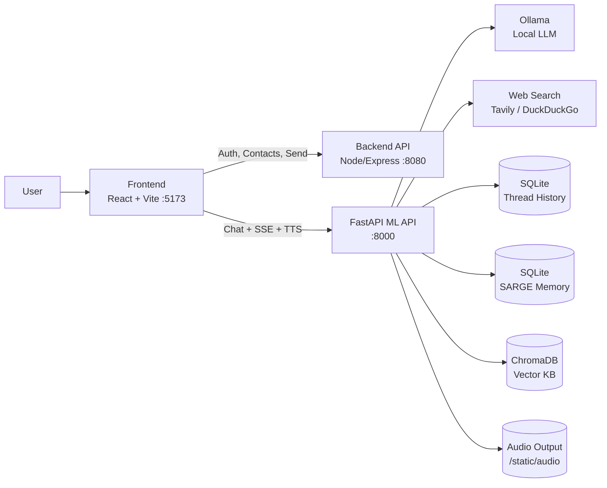
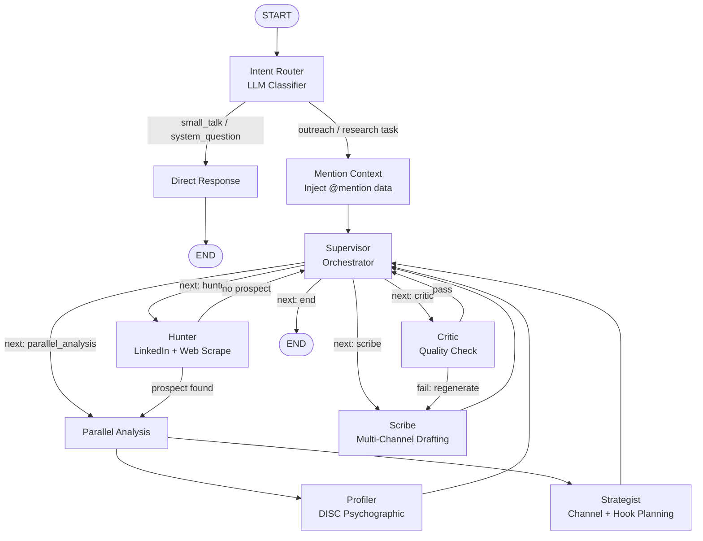
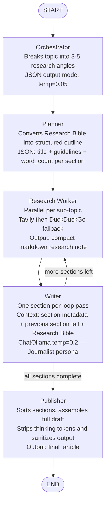
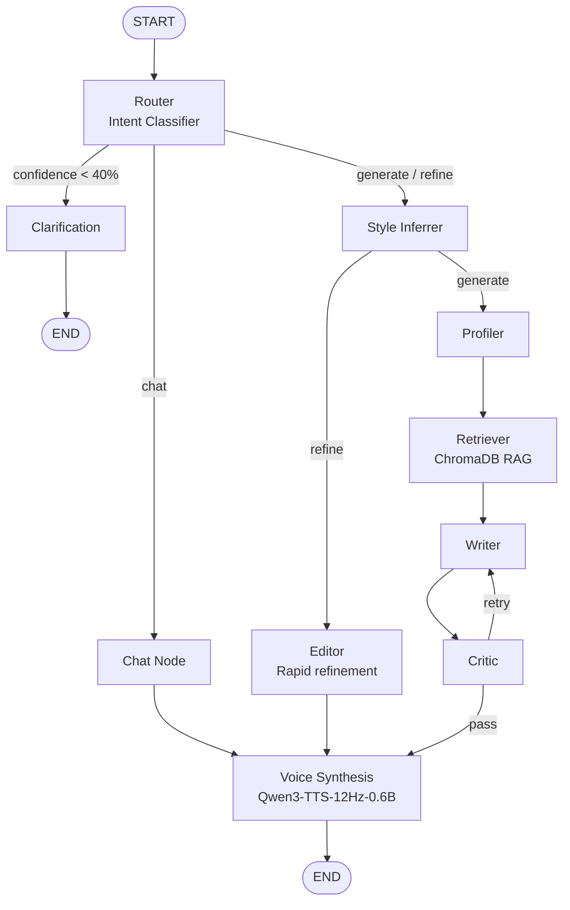

<div align="center">

# Outreach Bot

**Local-first, AI-powered outreach automation. Research, profile, draft, and send — all in one agent pipeline.**

[](https://fastapi.tiangolo.com/)
[](https://langchain-ai.github.io/langgraph/)
[](https://reactjs.org/)
[](https://ollama.ai/)

</div>

---

## Screenshots

<table>
  <tr>
    <td align="center" width="50%">
      
      <br/><sub><b>Outreach Dashboard — A complete analysis of Leads</b></sub>
    </td>
    <td align="center" width="50%">
      
      <br/><sub><b>Multi-Channel Draft Cards — Email, LinkedIn, WhatsApp</b></sub>
    </td>
  </tr>
  <tr>
    <td align="center" width="50%">
      
      <br/><sub><b>Live Streaming — Watch the agent think in real time</b></sub>
    </td>
    <td align="center" width="50%">
      
      <br/><sub><b>@Mention Context — Inject contact details instantly</b></sub>
    </td>
  </tr>
  <tr>
    <td align="center" width="50%">
      
      <br/><sub><b>Writer Studio — AI-powered article drafting</b></sub>
    </td>
    <td align="center" width="50%">
      
      <br/><sub><b>SARGE Agent — Voice synthesis with Qwen3-TTS</b></sub>
    </td>
  </tr>
  <tr>
    <td align="center" colspan="2">
      
      <br/><sub><b>Persistent Thread History — Resume any conversation</b></sub>
    </td>
  </tr>
</table>

---

## The Problem

Cold outreach is broken. Sales reps and founders spend **hours** per prospect:

- Manually reading LinkedIn profiles, blog posts, and company news
- Guessing which channels (email? DM? WhatsApp?) are most likely to get a reply
- Writing generic templates that feel impersonal and get ignored
- Re-drafting the same message multiple times until it finally sounds human

The result: **low reply rates, high time cost, and burned-out teams.**

---

## How Outreach Bot Solves This

Outreach Bot replaces that manual loop with a **supervised AI agent pipeline**. You describe your goal in natural language. The agents handle the rest:

| Problem | Solution |
|---|---|
| Hours of research per prospect | **Hunter agent** scrapes LinkedIn + web in seconds |
| Unknown personality/tone fit | **Profiler** builds a DISC psychographic profile |
| Wrong channel selection | **Strategist** picks email, DM, or WhatsApp based on context |
| Generic copy | **Scribe** generates channel-optimized, personalized drafts |
| Garbage outputs | **Critic** rejects and regenerates until quality passes |
| No voice follow-up | **Qwen3-TTS** synthesizes voiced audio of your message |

The platform is **100% local-first** — no data leaves your machine. All generation happens through Ollama running on your hardware.

---

## Platform Overview

Outreach Bot is a three-service system:

```
Outreach_bot/
  Frontend/    ← React + Vite chat UI with draft preview cards
  backend/     ← Node/Express: auth, contacts, send actions
  fastapi/     ← FastAPI + LangGraph: all AI agents and TTS
```

The `fastapi/` service hosts **three independent agent systems**:

| Agent | Endpoint | Purpose |
|---|---|---|
| Research Outreach Agent | `/ml/agent/chat` | Deep-psych outreach pipeline |
| Digital Newsroom (Writer) | `/ml/agent/writer/chat` | Long-form AI article generation |
| SARGE | `/ml/agent/sarge/chat` | Conversational assistant + voice |

---

## System Architecture



---

## Agent Architectures

### Agent 1 — Research Outreach Pipeline

The flagship pipeline for deep prospect research and personalized multi-channel draft generation.



**Each agent node explained:**

| Node | Role | What it does |
|---|---|---|
| `intent_router` | Gatekeeper | Classifies intent; extracts the "Topic Lock" for focus |
| `mention_context` | Context injector | Pulls `@mention` contact data into the conversation state |
| `supervisor` | Orchestrator | Decides the next node to invoke based on current state |
| `hunter` | Researcher | Scrapes LinkedIn, web, and news using DuckDuckGo + custom crawlers |
| `profiler` | Psychologist | Builds a DISC personality profile; infers tone and communication style |
| `strategist` | Planner | Selects optimal channels (email/LinkedIn/WhatsApp/SMS) and crafts the hook angle |
| `scribe` | Writer | Generates parallel multi-channel drafts with strict 4-part email structure |
| `critic` | QA loop | Checks for hallucinations, instruction adherence, and personalization depth; rejects and forces retry |

---

### Agent 2 — Digital Newsroom (Writer Agent)

A dedicated long-form content pipeline that researches, plans, writes, and edits full articles section-by-section.



#### Node-by-Node Detail

**1. `orchestrator`** — Editor-in-Chief
- Reads `state.topic` and calls `ChatOllama` (temperature `0.05`, JSON mode) with `ORCHESTRATOR_PROMPT`
- Produces 3–5 focused `sub_topics` as research angles
- Normalizes and de-duplicates via `_coerce_sub_topics()`; uses smart defaults for well-known subjects
- Resets all writing state fields for a clean run

**2. `planner`** — Architect
- Receives the compiled `research_bible`
- Calls `ChatOllama` (temperature `0.05`, JSON mode) with `PLANNER_PROMPT`
- Produces a structured outline: `[{title, guidelines, evidence_hint, word_count}, ...]`
- `_normalize_outline()` validates, pads missing sections, and enforces `word_count ∈ [120, 320]`
- Targets 5 sections for articles ≥900 words, 4 for ≥700 words, 3 for shorter pieces

**3. `research_worker`** — Field Researcher _(parallel per sub-topic)_
- Tries **Tavily** first; falls back to **DuckDuckGo** automatically
- Filters results for topic relevance using `_filter_search_results_by_topic()`
- Outputs one compact markdown research note per sub-topic into `gathered_notes`

**4. `writer`** — Journalist _(loop: one section per pass)_
- Reads `outline[current_section_index]` for current section metadata
- Uses `_tail_sentences()` on the previous section to maintain narrative continuity
- Sends only focused context to the LLM: section metadata, previous tail (max 500 chars), and `research_bible`
- Validates output with `_is_generic_or_drifting()` and `_looks_robotic()` quality guards
- Updates `draft_sections[index]` and increments `current_section_index`
- Loop continues until `current_section_index >= len(outline)`

**5. `publisher`** — Editor
- Sorts `draft_sections` by index and joins into one cohesive draft
- Strips `<think>…</think>` tokens and sanitizes instruction leakage with `_sanitize_writer_output()`
- Writes `final_article` to state

#### State Schema

```python
class AgentState(TypedDict):
    topic: str                        # The user's writing request
    sub_topics: List[str]             # Research angles (from orchestrator)
    gathered_notes: List[str]         # Parallel research results (reducer)
    research_bible: str               # Synthesized source document
    outline: List[Dict[str, Any]]     # Planned sections
    current_section_index: int        # Writer loop cursor
    draft_sections: Dict[int, str]    # Per-section generated markdown
    final_article: str                # Final polished output
    logs: List[str]                   # Streamed thought events for UI
```

#### Quality Guardrails

| Guard | Mechanism |
|---|---|
| Search failure | Tavily → DuckDuckGo automatic fallback |
| Bad JSON from LLM | `_safe_json_loads()` strips code fences and retries |
| Thin/missing outline | `_normalize_outline()` seeds sections with auto-generated titles |
| Robotic prose | `_looks_robotic()` checks sentence-starter duplication and cliché markers |
| Topic drift | `_is_generic_or_drifting()` detects off-topic content |
| Thinking token leakage | `strip_thinking_tokens()` removes `<think>…</think>` blocks |

---

### Agent 3 — SARGE

Conversational assistant with real-time voice synthesis.



---

## Storage Map

| Area | Storage Backend | Purpose |
|---|---|---|
| Thread history | `fastapi/database.db` (SQLite) | Chat thread persistence for all agents |
| SARGE memory | `sarge_memory.db` (SQLite) | Session-level short-term memory for SARGE |
| Voice profiles | `assets/voice_profiles/` + `profiles.json` | Uploaded voice clone references |
| Generated audio | `static/audio/` | WAV files served to the frontend |
| Knowledge base | `ml/application/agent/data/` | Prospect JSON, psych profiles, Chroma vector history |

---

## Tech Stack

| Layer | Technology |
|---|---|
| **Frontend** | React 18, Vite, TailwindCSS, Axios, Server-Sent Events |
| **Backend API** | Node.js, Express, MongoDB |
| **ML API** | Python 3.11, FastAPI, Uvicorn, Pydantic |
| **AI Orchestration** | LangGraph (StateGraph), LangChain |
| **LLM Inference** | Ollama (local), `instructor` for structured JSON output |
| **Vector DB** | ChromaDB (optional RAG) |
| **Database** | SQLite (threads), MongoDB (users/contacts) |
| **Search** | Tavily API, DuckDuckGo (`ddgs`) |
| **TTS** | Qwen3-TTS-12Hz-0.6B-Base |

---

## Software Architecture

### Frontend (`Frontend/`)

Built with **React 18 + Vite + TailwindCSS**. Single-page application with a sidebar-driven layout.

**Key components:**

| Component | Purpose |
|---|---|
| `Dashboard.jsx` | Root layout — wires sidebar, chat view, and contact panel together |
| `ChatSidebar.jsx` | Thread history list; create/resume conversations |
| `thread/` | Core chat interface: message list, input bar, streaming renderer |
| `components/ContactList.jsx` | Manage contacts; supports `@mention` injection into the chat |
| `components/MarkdownRenderer.jsx` | Renders agent markdown output including draft cards |
| `writer/` | Writer Studio — dedicated UI for the Digital Newsroom agent |
| `pages/` | Auth pages (Login, Register) and settings |
| `providers/` | Auth context, theme, and API client setup |
| `hooks/` | Custom hooks for streaming SSE, thread management, and auth state |

**Communication pattern:**
- All chat messages are sent as **POST** requests to the FastAPI `/ml/agent/chat` endpoint
- Responses are received as **Server-Sent Events (SSE)** — the UI processes `thought`, `response`, and `done` event types in real time
- Contact and auth operations go to the Node.js backend over plain HTTP

---

### Backend (`backend/`)

Built with **Node.js + Express + MongoDB**. Handles everything that is not AI — auth, user profiles, contacts, and outbound message sending.

**Route modules:**

| File | Handles |
|---|---|
| `routes/auth.js` | Register, login, JWT issuance |
| `routes/user.js` | User profile read/update |
| `routes/contacts.js` | CRUD for contact records; used for `@mention` data |
| `routes/chat.js` | Proxy/helper for chat history retrieval from the backend side |
| `routes/send.js` | Triggers email send via Nodemailer using drafted content |

**Models** (`backend/models/`): Mongoose schemas for User, Contact, and ChatSession.

The backend does **not** run any AI logic — it delegates all generation to the FastAPI service.

---

### FastAPI ML Service (`fastapi/`)

Built with **Python 3.11 + FastAPI + LangGraph**. The AI brain of the platform.

**Entry point and routing:**

```
fastapi/
  main.py              ← App creation, CORS, static file serving, router inclusion
  ml/
    routes.py          ← All /ml/* endpoints; lazy-loads agent modules on first request
    application/
      agent/           ← Research Outreach Agent (Hunter → Scribe → Critic pipeline)
      sarge/           ← SARGE agent (conversation + voice synthesis)
    ollama_deep_researcher/
                       ← Digital Newsroom Writer Agent
    infrastructure/
      db/sqlite.py     ← SQLite connection + thread/message persistence helpers
```

**Lazy loading pattern** — agent graphs are only imported and compiled on first request (`_ensure_agent_loaded`, `_ensure_sarge_loaded`, `_ensure_deep_research_loaded`). This keeps startup fast and resilient to optional dependencies being absent.

**SSE streaming pattern** — all chat endpoints return `StreamingResponse` with `text/event-stream`. Events emitted:

| Event type | Payload |
|---|---|
| `thought` | Internal agent log / phase label shown as "thinking" |
| `response` | Incremental markdown content streamed to the chat bubble |
| `done` | Final metadata: `thread_id`, `word_count`, `writer_mode` |
| `error` | Error message if any node fails |

**LangGraph integration** — each agent is a compiled `StateGraph`. The route calls `graph.astream(...)` and maps each node update to the appropriate SSE event type. If streaming misses the final output, routes fall back to `graph.ainvoke(...)` once to recover content.

---

## Prerequisites

- Node.js 18+ and npm
- Python 3.11+
- `uv` — Python package manager (`pip install uv`)
- MongoDB — local or Atlas (for backend)
- Ollama — required for local LLM generation

---

## Environment Setup

### 1. Backend — `backend/.env`

```env
MONGO_URI=mongodb://localhost:27017/your_db
PORT=8080
MAIL_USER=your_email@example.com
EMAIL_PASS=your_app_password
```

### 2. FastAPI — `fastapi/.env`

```bash
cp fastapi/.env.example fastapi/.env
```

Minimum required:

```env
MONGO_URI=mongodb://localhost:27017/your_db
DATABASE_NAME=outreach_bot
MODEL_NAME=qwen2.5:7b
# TAVILY_API_KEY=your_key   (optional, improves research quality)
```

### 3. Frontend — `Frontend/.env`

```env
VITE_API_URL=http://localhost:8000
VITE_ASSISTANT_ID=agent
```

---

## Install Dependencies

```bash
# Frontend
cd Frontend && npm install

# Backend
cd backend && npm install

# FastAPI
cd fastapi && uv sync
```

### Optional: Qwen3-TTS (Voice Cloning)

```bash
cd fastapi
powershell -ExecutionPolicy Bypass -File scripts/setup_qwen_tts.ps1
```

Set in `fastapi/.env`:
```env
QWEN_TTS_MODEL=./models/Qwen3-TTS-12Hz-0.6B-Base
```

---

## Run the Project

**Terminal 1 — FastAPI**
```bash
cd fastapi
uv run uvicorn main:app --host 0.0.0.0 --port 8000 --reload
```

**Terminal 2 — Backend**
```bash
cd backend && npm run dev
```

**Terminal 3 — Frontend**
```bash
cd Frontend && npm run dev
```

| Service | URL |
|---|---|
| Frontend | http://localhost:5173 |
| FastAPI | http://localhost:8000 |
| Backend | http://localhost:8080 |

---

## Ollama Setup

```bash
ollama serve
ollama pull qwen2.5:7b
```

---

## Quick Smoke Test

```bash
curl http://localhost:8000/
```

Expected:
```json
{ "message": "Xenia26 Backend API", "status": "running", "agent_endpoint": "/ml/agent/chat" }
```

---

## Notes

- Do not commit real credentials to `.env` files — they are already in `.gitignore`
- The project supports both real-time SSE streaming and sync draft responses
- Agent modules are lazy-loaded on first request to keep startup fast
- TTS is optional — SARGE text flows work even if voice dependencies are absent

---

## Additional Docs

- [`AGENT_ARCHITECTURE_MAP.md`](./AGENT_ARCHITECTURE_MAP.md) — Complete route-to-agent map and all graph topologies
- [`PROJECT_ARCHITECTURE.md`](./PROJECT_ARCHITECTURE.md) — Full component breakdown
- [`fastapi/ml/ollama_deep_researcher/DEEP_RESEARCH_AGENT.md`](./fastapi/ml/ollama_deep_researcher/DEEP_RESEARCH_AGENT.md) — Writer agent in-depth documentation
